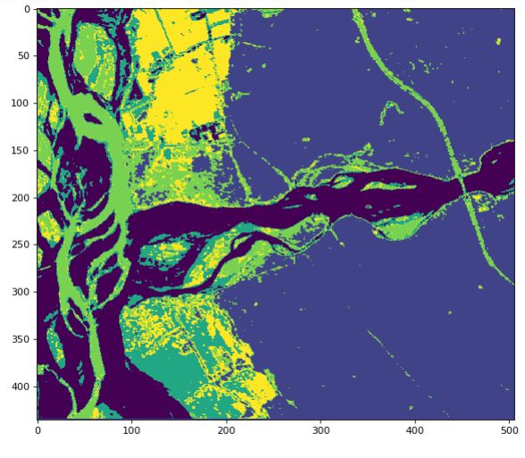

# Hybrid CNN-RNN Model for Hyperspectral Satellite Image Classification

Satellite image processing is one of the key research areas in the area of remote sensing. In hyperspectral satellite imaging information from across a wide range of electromagnetic spectrum is collected by satellites. The goal of Remote Sensing is to obtain the spectrum for each pixel in the image of a scene, with the purpose of terrain analysis and generation, topographic mapping.  

Traditional statistical approaches provides reasonable success in this field, but the efficiency is limited with respect to the robustness of results. The statistical approaches are parametric, based on an assumed statistical distribution and hence the efficiency and correctness of results closely correlates to the proximity of data to the assumed distribution. Today advancements in artificial intelligence have made autonomous, large scale analysis of imagery possible, now AI can be taught to process Satellite Imagery with a small degree of error.  

In the following model we use hybrid CNN- RNN model for classification of each pixel to its corresponding classes. Further the code is developed to classify pixels in accordance with soft as well as hard classification techniques. 
<b>1.) HARD CLASSIFICATION :</b> A pixel strictly belongs to a single class.  
<b>2.) SOFT CLASSIFICATION :</b> A pixel may belong to more than one class based on its membership value.   

## Libraries used 
* <b>Keras</b>: Keras is an open-source neural-network library written in Python. Designed to enable fast experimentation with deep neural networks, it focuses on being user-friendly, modular, and extensible.
* <b>Tensorflow</b>: TensorFlow is a free and open-source software library for dataflow and differentiable programming across a range of tasks. It is a symbolic math library, and is also used for machine learning applications such as neural networks.
* <b>GDAL</b>: The Geospatial Data Abstraction Library is a computer software library for reading and writing raster and vector geospatial data formats, and is released under the permissive X/MIT style free software license by the Open Source Geospatial Foundation.
* <b>Pillow</b>: Python Imaging Library is a free library for the Python programming language that adds support for opening, manipulating, and saving many different image file formats.
* <b>Tkinter</b>: Tkinter is the standard GUI library for Python. Python when combined with Tkinter provides a fast and easy way to create GUI applications. 
* <b>Pickle</b>: The pickle module implements binary protocols for serializing and de-serializing a Python object structure. “Pickling” is the process whereby a Python object hierarchy is converted into a byte stream, and “unpickling” is the inverse operation, whereby a byte stream (from a binary file or bytes-like object) is converted back into an object hierarchy.
* <b>Numpy</b>: NumPy is a library for the Python programming language, adding support for large, multi-dimensional arrays and matrices, along with a large collection of high-level mathematical functions to operate on these arrays.
* <b>Matplotlib</b>: Matplotlib is a plotting library for the Python programming language and its numerical mathematics extension NumPy.  
## Description
The repository consists of following files and folders
* <b>Notebooks</b>: It consists of two jupyter notebooks
    - Hybrid CNN- RNN Model
    - Classification Tool (Hybrid CNN- RNN Model)
* <b>utils.py</b>: Contains the necessary functions used in the notebook
* <b>Dataset</b>: 
    - Header and Image file (subfebformosat2)
    - Training set of 6 classes
* <b>Results</b> 
## Results

 
<b>HARD CLASSIFICATION</b>
   
 
<b>SOFT CLASSIFICATION</b>
